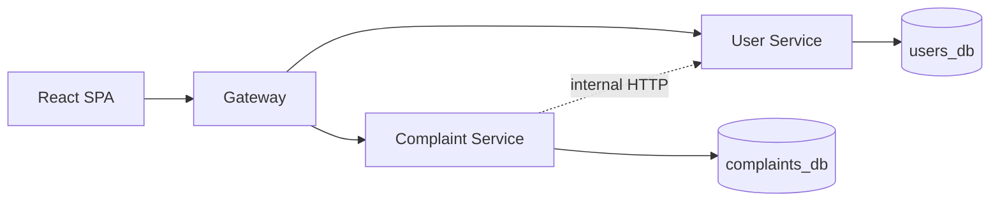

# Smart Apartment Maintenance System — Backend

Microservices monorepo: **User Service** (auth, users in `users_db`), **Complaint Service** (complaints in `complaints_db`, uploads), and **API Gateway** (single CORS entry, path-based proxy). The React app calls the **gateway only** (default `http://localhost:8000`).

## Prerequisites

- Docker Desktop (or Docker Engine) with Compose
- Python 3.9+ for local pytest without containers

## Quick start (Docker)

From this directory:

```bash
cp .env.example .env
docker compose up --build
```

- Gateway: `http://localhost:8000` (Swagger: `/docs` on each service port is `8001`, `8002`, `8000` may not aggregate OpenAPI)
- User Service: `http://localhost:8001/docs`
- Complaint Service: `http://localhost:8002/docs`

Seeded demo accounts (when `SEED_DEMO_USERS=1`):

- Admin: `admin@apartment.local` / `Admin123!pass`
- Staff: `staff@apartment.local` / `Staff123!pass`

Residents register via `POST /auth/register` through the gateway.

## Environment

See `.env.example`. **JWT_SECRET** must match between User Service and Complaint Service. **CORS_ORIGINS** on the gateway must list the frontend origin (e.g. `http://localhost:5173`).

## Databases

| Database    | Service        | Collections |
|------------|----------------|-------------|
| `users_db` | User Service   | `users`     |
| `complaints_db` | Complaint Service | `complaints` |

## Local development (without Docker)

Install MongoDB locally, then:

```bash
python3 -m venv .venv
source .venv/bin/activate
pip install -r requirements.txt
export JWT_SECRET=dev-secret-change-me-use-at-least-32-chars-long!!
export MONGO_URI=mongodb://localhost:27017
export PYTHONPATH=packages/shared/src:services/user_service
uvicorn app.main:app --reload --port 8001
```

Run Complaint Service and Gateway in separate terminals with the appropriate `PYTHONPATH` and ports.

## Tests

```bash
source .venv/bin/activate
pip install -r requirements.txt
pytest
```

## Architecture


